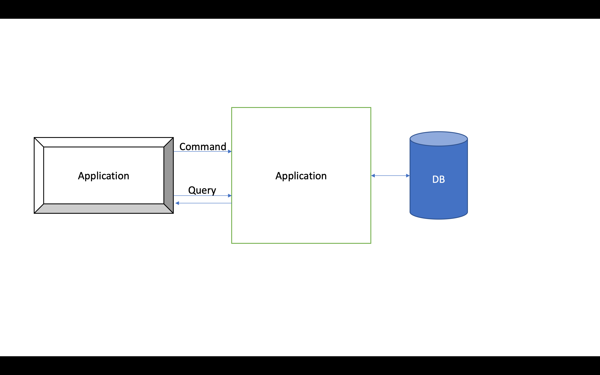
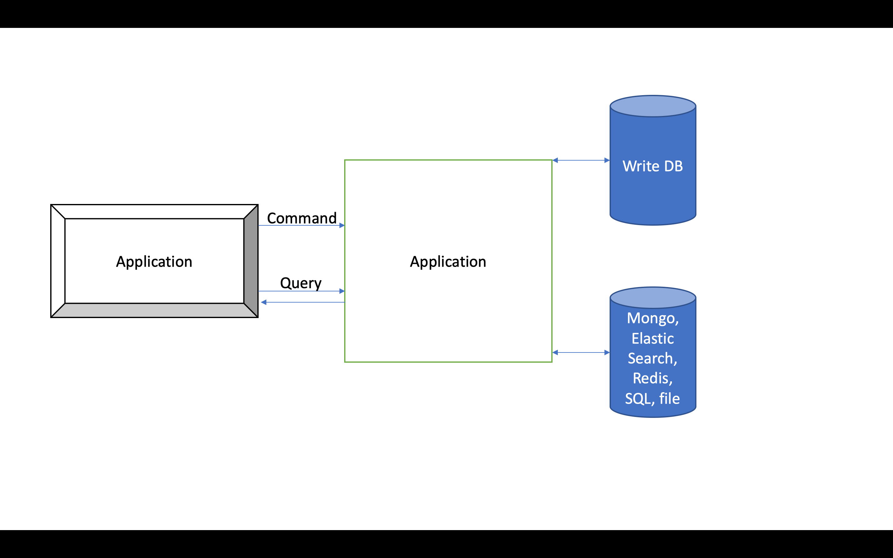

import { Notes, Image } from 'mdx-deck';
import { future, hack, dark, swiss } from 'mdx-deck/themes';
import { CodeSurfer } from 'mdx-deck-code-surfer';
import shadesOfPurple from 'prism-react-renderer/themes/shadesOfPurple';
import nightOwl from 'prism-react-renderer/themes/nightOwl';
import duotoneLight from 'prism-react-renderer/themes/duotoneLight';

export { components } from 'mdx-deck-code-surfer';

export const theme = {
  //...dark,
  ...future,
  codeSurfer: {
    ...shadesOfPurple,
    //...duotoneLight,
    showNumbers: false,
  },
};

# Refactoring to CQRS

[presentation-refactoringtocqrs.netlify.com](presentation-refactoringtocqrs.netlify.com)

---

### About me 👋

- Toni Petrina
- Visma e-conomic
- github.com/tpetrina
- @to_pe

---

# What is CQRS?

---

## Command Query Responsibility Segregation

---

<p>Or in its weaker form <code>Command Query Segregation</code> (CQS)</p>

---

Main idea: separate commands (operations that change data) from queries (operations that read data).

Can be done at:

- code level - requires diligence (sometimes libraries can help)
- architecture level - harder, but more benefits

---

## Motivation

- In CRUD domain entites are resources
- All operations have same "value"
- Most UIs are task based and expressive, REST is not (but RPC is)
- REST is incompatible with task based approach

---

```clike
class UserController
{
  [HttpGet]
  ActionResult<UsersDto> GetUsers() { /* */ }

  [HttpGet]
  ActionResult<UserDto> GetUser(UserId) { /* */ }

  [HttpPost]
  ActionResult<UserId> CreateUser(UserDto) { /* */ }

  [HttpPut]
  ActionResult<Unit> UpdateUser(UserDto) { /* */ }

  [HttpDelete]
  ActionResult<Unit> DeleteUser(UserId) { /* */ }
}
----
* > Simple RESTful UserController
9:10 > Creating user
12:13 > Non-semantic update - what are we updating?
3:4 > Generic fetch for...what purpose?
```

---

## Another problem with non-semantic entry points

- Controllers have generic actions
- Services have generic interface
- Database have generic mapping (generic repository pattern)
- Which leads to anemic domains and lots of boilerplate

---

## Questions

- How to know what is updated?
  - Update email must have confirmation flow
  - Update password is not the same as changing email preference
- Fetching data is too generic
  - Overfetching is rampant
  - Hard to match fetch/update methods

---

CQRS is often combined with:

- DDD - why aren't you using it anyway?
- Event Sourcing - beyond the scope

---

# Let's refactor!

---

```clike
class ChangeEmailDto
{
  string NewEmail { get; set; }
}

class UserController
{
  [HttpPost("change-email")]
  ActionResult<bool> ChangeEmail(ChangeEmailDto dto)
  {
    return _userService.ChangeEmail(dto);
  }
}
----
* > Semantic actions
1:4 > Intention in name and data
8:12 > Semantic action - quite obvious
```

---

```clike
interface IUserService
{
  /* */
  bool ChangeEmail(ChangeEmailDto dto);
  /* */
}

class UserService : IUserService
{
  /* */

  bool ChangeEmail(ChangeEmailDto dto)
  {
    /* */
  }

  /* */
}
----
* > Implementation in the service layer
1:6 > Our interface keeps growing
10:15 > Our method stands out a bit
```

---

## Problem

- Becomes repetitive in different sense
- Service layer essentially becomes namespace/module
- Performance hit in the request DI build-up phase
- Proliferation of get methods - semantic ones (but it might be good!)

---

```clike
interface IUserService
{
  /* */
  bool ChangeEmail(ChangeEmailDto dto);
  /* */
}

// actually typed as:
// ChangeEmailDto => bool
----
* > Start with the original method
```

---

```clike
// let's introduce command instead of Dto
class ChangeEmailCommand
{
  int UserId { get; }
  string NewEmail { get; }
}
----
* > Obvious intention and data (serializable method call)
```

---

```clike
// and the handler
class ChangeEmailCommandHandler
{
  ChangeEmailCommandHandler(
    /* dependencies */
  )
  {}

  bool Execute(ChangeEmailCommand command)
  {
    /* */
  }
}
----
* > Handling commands is isolated
4:7 > Only take what is absolutely needed
9:12 > Given a command, do something with it
```

---

```clike
interface IUserService
{
  /* */
  bool ChangeEmail(ChangeEmailDto dto);
  /* */
}

// =>

class ChangeEmailCommandHandler
{
  bool Execute(ChangeEmailCommand command) { /* */ }
}
----
* > Refactoring to command
```

---

```clike
// marker interface
interface ICommand {}

// generic handler
interface ICommandHandler<TCommand>
  where TCommand : ICommand
{
  bool Execute(TCommand dto);
}

// our implementation
class ChangeEmailCommandHandler
  : ICommandHandler<ChangeEmailCommand>
{
  bool Execute(ChangeEmailCommand command) { /* */ }
}
----
* > Refactoring to command
1:2 > Marker interface (for tooling, reflection)
4:9 > Generic interface for all commands
11:16 > Isolated implementation
```

---

```clike
class UserController
{
  [HttpPost("change-email")]
  ActionResult<bool> ChangeEmail(
    [FromBody]     ChangeEmailDto            dto,
    [FromServices] ChangeEmailCommandHandler handler)
  {
    var command = new ChangeEmailCommand(CurrentUser, dto.NewEmail);
    return handler(command);
  }
}
----
1 > Time to update our user controller
4:10 > Simply call the handler
```

---

```clike
class UserController
{
  ICommandHandler<ChangeEmailCommand> handler;

  UserController(ICommandHandler<ChangeEmailCommand> handler)
  {
    this.handler = handler;
  }

  [HttpPost("change-email")]
  ActionResult<bool> ChangeEmail([FromBody] ChangeEmailDto dto)
  {
    var command = new ChangeEmailCommand(CurrentUser, dto.NewEmail);
    return handler(command);
  }
}
----
3,5,7 > Use Dependency Injection
11:15 > Simpler actions
```

---

## Should Dto actually be a command?

- Easier to evolve separately (contract)
- Enrich command from ambient (e.g. controller) data
- Merge route parameters and body

---

## Some design decisions

- Naming: `Execute`, `Handle`
- Return type: `void`, `Task`, `Task<Either<Error, Result>>`
- Manual construction of handlers vs DI

---

## On the query side

- Similar interface `IQuery<TQueryResult>`
- Similar handler `IQueryHandler<TQuery, TQueryResult>`
- Also known as query object pattern

[Meanwhile... on the query side of my architecture](https://blogs.cuttingedge.it/steven/posts/2011/meanwhile-on-the-query-side-of-my-architecture/)

---

## Why are repositories bad?

- Either you specialize them too much or have generic repository
- Not all reads are equal
- Specification pattern can be replaced with query object pattern
- Reading in commands is _different_ than reading from the client!

---

```clike
class UserRepository
{
  UserDto[] GetUsers();
  UserDto GetUser();
  UsersDto GetUserForAccount(int accountId);
  UsersDto GetArchivedUsers(int accountId);
  /* */
}
----
* > Either you specialize them too much or have generic repository
```

---

```clike
class UserRepository
{
  // for HttpGet
  // mapping required, not all data needs to be present
  UserDto GetUser();

  // enriching (JOINs)
  UserDtoWithNotifications GetUserWithNotifications();

  /* */
}
----
* > Not all reads are equal
```

---

```clike
class UserRepository
{
  // specification is custom for each repository
  // combinatorial explosion
  // lack of predictability
  UserDto[] GetUsers(UserSpecification specification);
}
----
* > Specification pattern can be replaced with query object pattern
```

---

```clike
class UserRepository
{
  // for HttpGet
  // mapping required, not all data needs to be present
  // not tracked by EF
  UserDto GetUser();

  // for updating user (domain model)
  // tracked by EF
  UserEntity GetUser();

  /* */
}
----
* > Reading in commands is _different_ than reading from the client!
```

---

## Query objects are powerful

- Avoid using domain model completely!
- Can use raw SQL (or Dapper as opposed to EF in the command model)
- Caching can be done only for this layer

---

```clike
class GetActiveUsersQuery
  : IQuery<GetActiveUsersResult>
{}

class GetActiveUsersQueryHandler
  : IQueryHandler<GetActiveUsersQuery, GetActiveUsersResult>
{
  // use Dapper
  IConnection connection;

  GetActiveUsersQuery(IConnection connection)
    => this.connection = connection;

  GetActiveUsersResult Execute(GetActiveUsersQuery query)
  {
    return connection.Query<GetActiveUsersResult>(
      "SELECT * FROM Users WHERE IsActive = 1");
  }
}
----
* > An example query
2 > Declare the return type
5:6 > Handler specifies both input and output
8:12 > Use Dapper for higher performance
14:18 > Raw SQL to avoid ORM
```

---

# So if read layer can look differently...

---

Separating databases

- SQL -> use replication and have replica used in the read model
- Use different database for read (Mongo, Elastic Search)
- Key idea is that we can split read from write model
  - Not all applications have similar load on the read/write
  - Read model can be simplified (document) while modifications are done on the normalized database

---



---



---

## Example 1: digital signage application

- CMS for editing media items, playlists, channels
- Items in multiple playlists, playlists in multiple channels (normalized model, rare writes)
- End devices pick channel and play schedule (poll for update, JSON document)
- Update `[dbo].[Schedule]` on every change

---

## Example 2: static content for mobile app

- CMS for editing pages and their content
- Devices poll for updates
- Manual publishing - `[dbo].[Cache]` - it might take a minute

---

## Spectrum of options:

- Just separate commands and queries
- Use optimized queries/views for reads
- Add columns for caching
- Add tables for caching
- Different SQL instances (replicas)
- Different DB technologies

---

## Adopting CQRS increases performance

- Faster to reason with (self-contained code)
- Faster to run (smaller DI graph)
- More manageable code (append only files, less conflicts)
- Easier to test

---

## Testability

---

```clike
class TestUsers
{
  [Fact]
  void User__CanChangeEmail()
  {
    // Arrange
    var handler = new ChangeEmailCommandHandler();
    var command = new ChangeEmailCommand(1, "new@email.com");

    // Act
    var result = handler.Execute(command);

    // Assert
    result.Should().BeTrue();
  }
}
----
* > Unit testing is easy
7 > Easy to mock dependencies specific to this test
11 > Check result and optionaly verify calls
```

---

```clike
[Test]
void UnverifiedNewUser__CannotCreateTasks()
{
  // Arrange
  new CreateUserCommandHandler().Execute(
    new CreateUserCommand("user@email.com));

  // Act
  var result = new CreateTaskCommandHandler().Execute(
    new CreateTaskCommand(
    name: "Task name",
    label: "Green"
  ));

  // Assert
  result.Should().BeFalse();
}

----
* > Easy to do integration tests!
4:6 > Use existing commands (BDD style)
8:13 > Straightforward code
```

---

```clike
[Test]
void VerifiedNewUser__CannotCreateTasks()
{
  // Arrange
  var id = new CreateUserCommandHandler(/* ... */);
  new VerifyUserCommandHandler()
    .Execute(new VerifyUserCommand(id));

  // Act
  var result = new CreateTaskCommandHandler()
    .Execute(new CreateTaskCommand(
    name: "Task name",
    label: "Green"
  ));

  // Assert
  result.Should().BeTrue();
}

----
* > Easy to do integration tests!
```

---

## But that's not all!

---

Decorators on commands extract cross cutting concerns.

---

```clike
class EFTransactionHandler<TCommand>
  : ICommandHandler<TCommand>
{
  EFTransactionHandler(
    DbContext context,
    ICommandHandler<TCommand> handler)
    => (this.context, this.handler) = (context, handler);

  bool Execute(TCommand command)
  {
    using (var transaction = context.Database.BeginTransaction())
    {
      handler(command);

      transaction.Commit();
    }
  }
}
----
* > Handler returns another handler!
1:2 > This is a generic handler...
6 > ...that receives an existing handler...
13 > ...later calls it...
11:16 > ...but it wraps it inside a transaction
```

---

```clike
var handler = new EFTransactionHandler<ChangeEmailCommand>(
  _context,
  new ChangeEmailCommandHandler(/* ... */)
);
----
* > Example usage
```

---

## Use a library

- MediatR for C#
- Helper classes in testing

---

## Takeaway

<blockquote>
  Refactoring traditional "service" object to CQRS involves separating the read
  part from the write part. After that, write part is split into task based
  methods as opposed to resource based methods. We can have multiple
  POST/PUT/PATCH methods that have semantic meaning.
</blockquote>

---

Questions?

---

Thank you!

- Toni Petrina
- @to_pe
